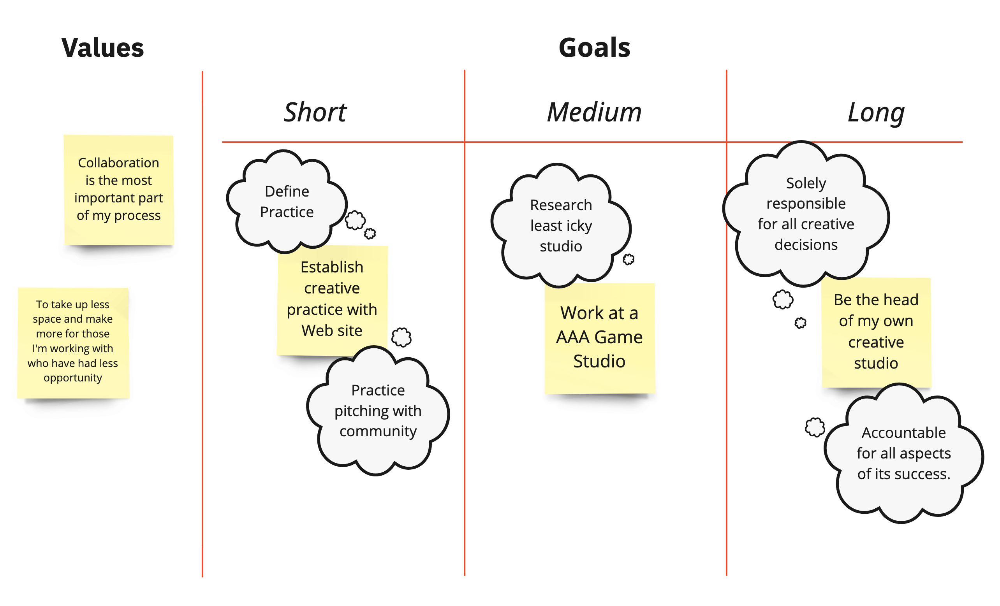

Today’s blog post is a deep dive into Weird Ghosts’ values.

This post captures the values of Weird Ghosts’ founders Jennie and Eileen, but also that of our extended community, including many of our investees as well as our collaborators [Gamma Space Cooperative Studio](https://www.gammaspace.ca/). We’ve already made many of our values clear in our mission statement, but wanted to articulate them in even more detail so that everyone applying to Weird Ghosts has a clear picture of what we stand for.

From the very beginning of Weird Ghosts, we have led from our values and this is something we encourage our investees to do as well. Leading from values means more difficult conversations up front, but healthier workspaces in the future. Our first activity with our investees after onboarding is a values exercise and “pain points” discussion.

_image credit: Henry Faber, Gamma Space_

Every organization has problems and tensions to work through. By acknowledging our pain points, we can begin to address them and come up with solutions. By talking about our values, we make sure that all studio founders are on the same page. Transparency is important for success, which just so happens to be why we wrote this blog post!

## Our values

**At the heart of it, we’re weird ghosts.** This is more than just a fun name. We embrace weirdness. We know the stigma that comes with not being “normal” and we believe deeply in the transformative possibilities of doing things differently. Of doing things better.

We also want to celebrate and embrace the ghosts of the world: that is, all the people who have been made invisible by systems of power. So much of the world has been radically changed by the invisible labour of underrepresented people. At Weird Ghosts, we want ghosts (and their ghostly labour) to be seen and fairly compensated.

Finally, we support games because we know that **games have the power to transform us**, as well as our communities and our culture. We believe that games can be vital to personal expression and that everyone should have equal access to making them in healthy, sustainable ways.

That is who we are at our core, but let’s break it down even further.

## Capitalism stinks

The games industry and games funding have a lot of issues, and many of these are tied in with the chokehold that capitalism has on us all. As we’ve written about before, there are [numerous barriers to accessing funding](https://weirdghosts.ca/blog/breaking-down-barriers-to-funding-for-canadian-game-studios/) for new and underrepresented studio founders. There are also many extractive and developer-negligent funding models out there. Many early game developers sign deals with publishers and funders not fully realising just how much of their business or profit they are giving away.

Weird Ghosts does not exist outside of capitalism (no one does), but we’ve tried to make our funding model as developer-friendly as possible. We aim to generate enough income to keep Weird Ghosts capable of cyclically funding studios, but operate closer to a non-profit than a for-profit company. We also prioritise studio founders paying themselves before they ever begin paying us back. For more information on how we fund, you can [read about our SEAL agreements](https://weirdghosts.ca/blog/how-we-make-investments/) on our blog.

Beyond our funding strategies, we also help mentor our investees on how to structure their time and businesses to avoid crunch, burnout, and the other capitalist pitfalls of the games industry. We practise the same values at Weird Ghosts, even if we struggle to do so at times. Capitalism is an omnipresent force and **it takes a community of people practising value-oriented intentional work to start creating these new ways of being.**

## Prioritising access and resisting power structures

One of our primary concerns in creating Weird Ghosts was to make games funding accessible to the people who are most commonly excluded from funding. We’ve written about that extensively [in our blog post about the barriers to funding](https://weirdghosts.ca/blog/breaking-down-barriers-to-funding-for-canadian-game-studios/). But we’re also interested in access as a practice of disability justice and challenging systemic norms.

Our mentorship program works virtually over video, call, or asynchronously through chat so that people can engage in a variety of ways depending on what best suits their needs. This also allows for a live transcription option if needed. Although we don’t focus on in-person events right now, the one we held was outside to create access amidst the ongoing COVID-19 pandemic. We know that participation looks different for everyone, so we work to offer a wide array of differing supports and mentorship structures.

Many people within our community (including Weird Ghosts’ founders) live with disabilities and neurodiversity, so we are constantly engaged in conversations about how to best support one another, work together in accessible ways, and make space for rest and care. **It’s very important that the people we work with are prioritising their health, even if this means that our structured time with them changes shape, involves more breaks, or goes longer than expected.**

As Leah Lakshmi Piepzna-Samarasinha writes in her book _Care Work_, community care doesn’t just happen magically, it takes work and intention. This is something that we have been collaborating with Gamma Space to practise and record intentionally, and we describe this process in detail when we onboard our studios.

## Anti-colonial

The co-founders of Weird Ghosts (Jennie and Eileen) are white settlers living on stolen land and, while we are aware of these privileges, we also know better than to say we are immune from the biases systemic racism burns into us. Our goal with Weird Ghosts has always been to leverage our privilege to make space for others, both by redistributing the capital donated by our primary funder, Infinite Ammo, as well as through our peer mentorship program.

In the first year and a half since launching Weird Ghosts, we have focused on supporting underrepresented individuals, particularly those who experience prejudice and barriers to funding for their skin colour, race, and culture. Our goal with Weird Ghosts is to grow collectively, so that the teams we support can become mentors in our future programs if they wish.

Beyond supporting founders and studios, we have also supported other organisations focused on IBPOC people and other underrepresented groups, including the PXR IBPOC Fellowship and Gamerella 2022.

We know that these are just some steps towards opposing colonialism. As we grow, we plan to continue expanding this impact beyond just the people we invest in, through donations, employment opportunities, and more.

## Community & loving justice

Weird Ghosts is grounded in the value of community. Our collaboration with Gamma Space means that our investees are also welcomed into a virtual community through Slack where they can share their projects, ask for tips and tricks, and get inspired to keep working.

We know that communities aren’t automatically perfect spaces, and that conflicts are a necessary part of community. What’s important is having a process and values around dealing with conflict and that’s why we are clear with all our investees about our code of conduct while onboarding them. In the cases where conflict arises, we aim to support all parties and help with any transitions through mentorship, conflict resolution, and other supports.

Sometimes the studios applying to our Baby Ghosts program are quite new and haven’t really thought about what it means to be a studio yet. In the case where a studio breaks up or changes shape, we work together with all members of the studio to get everyone prepared for the next steps in their journey as much as we can. **We aim to leave teams better off than when we began.**

We come at conflict from an approach of loving justice, a concept that is too big to fully capture in just one blog post, but which is defined beautifully by Kai Cheng Thom in [these online resources](https://abolitionist.tools/Loving-Justice). We know practices of transformative or loving justice don’t always work for everyone, but they have been very important for us in creating a community where people feel safe to be themselves, share their works in progress, and make mistakes.

## Trust & Safety

We put trust in our investees and they put trust in us. We know that we have the power in these relationships and that trust is a precious thing. That is why we have a code of conduct, clear conversations about what our support looks like and regular check-ins to make sure that studios are feeling supported.

It is important that everyone feels safe while participating in our community, even if there are challenging conversations coming up. We have a diverse group of mentors that investees can speak to if they feel more comfortable with one person than another. **We encourage our teams to create healthy working environments and ethical studio structures so that this trust and safety can continue on into other aspects of the games industry.**

We always aim to approach teams from a place of encouragement and support. We know that pitching, especially, can be stressful and Weird Ghosts is sometimes the first fund teams have ever pitched to. We have been refining our process to be both educational of what the pitching process is, while also providing feedback, encouragement, and a welcome environment to pitch in.

## Transparency, documentation, and information-sharing

When we launched, some people expressed some concern around our transparency and the funding for Weird Ghosts coming from Infinite Ammo Inc., which was run by Eileen’s late brother Alec Holowka, who was accused of abuse. We can state quite clearly that we do not support or condone abuse and that the concept and structure of Weird Ghosts is designed to foster more supportive, healthy, equitable working environments that we believe are necessary for improving the games industry and preventing future harm. We are grateful for the money left behind in Infinite Ammo that has made this mission possible. Beyond this, we ask for boundaries and privacy around this topic, as it is a complex one that involves the safety and well-being of many people, beyond just Eileen and their family.

Understanding that transparency comes with necessary boundaries, Weird Ghosts is committed to maintaining an open dialogue about our operations and values. We hope this blog post contributes to that effort. We deeply value information-sharing, which is why we use our blog posts and social media to not only share the success of our investees, but also to talk about our own organizational structure and how we operate. Weird Ghosts’ creation is indebted to the knowledge of so many other organizations (such as [Astra Fund](https://www.astragames.org/), among many others) who shared with us and we hope that sharing our own process can help inspire future initiatives, as well as more equitable funding options for games.

## Growth

Our website is a living document, and Weird Ghosts is an always-changing company. We value growth and learning and are always open to feedback on how to continue to improve. We believe in what adrienne maree brown terms “science-fictional behaviour.” That is, “work to change the world \[and\] being concerned with the way our actions and beliefs, now, today, will shape the future, tomorrow, the next generations” (_Emergent Strategy,_ pg. 16).

We grow alongside the studios we work with, as they create their impactful games, and create new ways of seeing the world. We value that opportunity to see and play those games probably most of all.

## Works Consulted

adrienne maree brown. _Emergent Strategy: Shaping Change, Changing worlds._ Chicago: AK Press, 2017.

Kai Cheng Thom. _I Hope We Choose Love: A Trans Girl’s Notes from the End of the World._ Vancouver: Arsenal Pulp Press, 2019.

Leah Lakshmi Piepzna-Samarasinha. _Care Work: Dreaming Disability Justice._ Vancouver: Arsenal Pulp Press, 2018.
